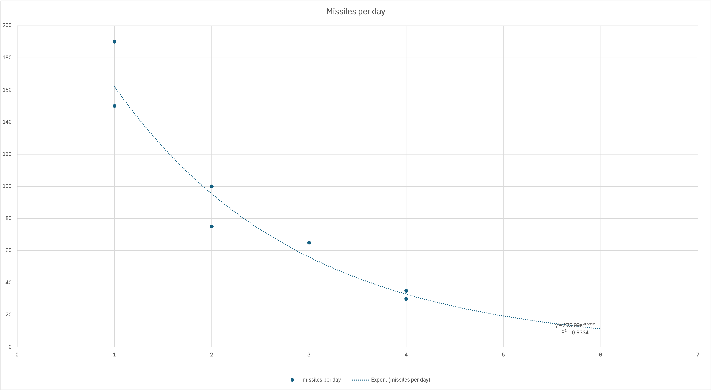
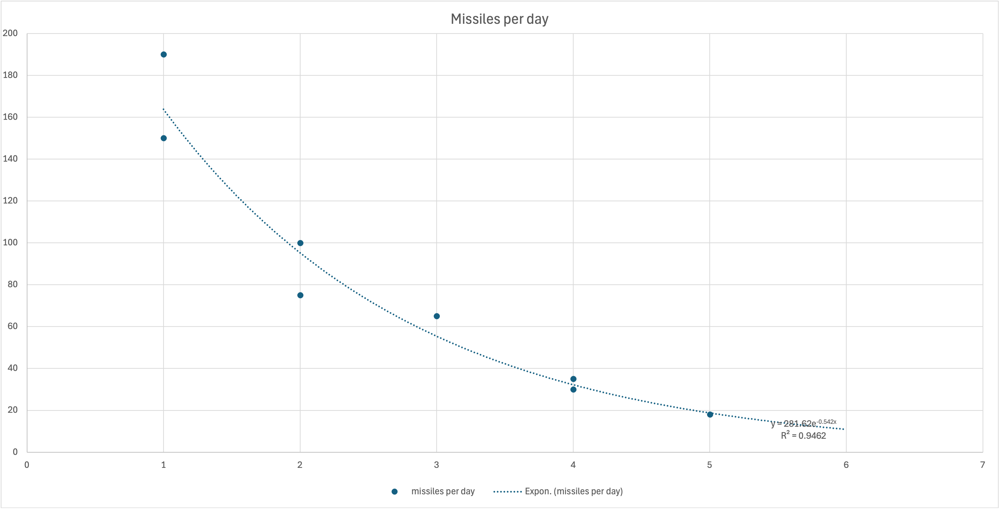

# Modeling Iran's Missile Launch Strategy: A Geometric Depletion Framework

## Preface

On the night of June 12, 2025, Israel launched a major strike on Iran. Iran’s primary strategic deterrent consists of its ballistic missile arsenal, which, according to the [Center for Strategic and International Studies (CSIS)](https://www.csis.org/analysis/irans-options-retaliating-against-israel), includes **between 1,000 and 3,000 missiles**.

Iran initiated its first retaliatory missile launches on June 13, around sunset (Israeli time).

From the outset, a critical question emerged: **How many missiles can Iran launch at Israel, and how quickly?** The answer is pivotal, as Iran’s ability to deliver high-volume barrages over multiple days could significantly shape the trajectory of the conflict.

This analysis suggests that Iran's launch behavior aligns with a geometric depletion model — predictable under a few operational assumptions.

---

## TL;DR

* Iran likely allocated **500–550 missiles** for active use in this campaign.
* Missile launches declined **geometrically**, beginning with **150–170 missiles** on Day 1, halving roughly each day.
* A **memoryless geometric sequence** fits the observed launch data closely.

---

## Theory: Optimal Use of Limited Munitions

Imagine you're a military planner tasked with scheduling daily missile launches from a finite stockpile. Your goal is to:

1. **Stay within total inventory**: You have a known missile count `s`, and your total usage must not exceed it.
2. **Start strong**: Maximize deterrent and damage early in the conflict.
3. **Decline quickly**: A sharp initial impact has more strategic and psychological weight.
4. **Stay memoryless**: The plan should only depend on the current stockpile, not the full history.
5. **Remain simple**: The simpler the strategy, the easier it is to implement under stress.

All of this suggests a **geometric sequence**:

```text
a_n = a_0 * q^n
```

Where:

* `a_0` is the number of missiles launched on Day 0
* `q` is the decay factor (`0 < q < 1`)
* The total number of missiles used is:

```text
sum = a_0 / (1 - q)
```

This strategy:

* Guarantees a finite, controlled sum.
* Declines rapidly.
* Adapts easily if missile stocks are reduced (e.g., airstrikes).
* Requires no state tracking — it's **memoryless**.
* Is operationally simple: launch a fixed percentage of what's left each day.

---

### Possible Strategic Reserve

Iran may also be holding back a **strategic reserve** of missiles, intended for last-resort use in case of regime collapse or major escalation. These missiles are likely excluded from the main launch sequence, so actual stockpiles may be larger than observed.

---

## Empirical Analysis

### Observed Launch Data

Based on open-source estimates:

| Day | Estimated Launches |
| --- | ------------------ |
| 1   | 150–190            |
| 2   | 75–100             |
| 3   | \~65               |
| 4   | 30–35              |

A least-squares exponential fit gives:

```text
a_n ≈ 275 * e^(-0.531n)   with R² = 0.933
```

This shows a strong correlation with geometric decay.



---

## Forecasting

### 17.6

Following the trend, the forecast for Day 5 (June 17, sunset) is **\~20 missiles**.

---

### Update 18.6

According to [Haaretz](https://www.haaretz.co.il/news/politics/war-2023/2025-06-18/ty-article-live/00000197-7fbd-d717-a1df-fffd1ca10000?liveBlogItemId=1669191297#1669191297), [Haaretz](https://www.haaretz.co.il/news/politics/war-2023/2025-06-18/ty-article-live/00000197-7fbd-d717-a1df-fffd1ca10000?liveBlogItemId=68016858#68016858), and [Haaretz](https://www.haaretz.co.il/news/politics/war-2023/2025-06-18/ty-article-live/00000197-7fbd-d717-a1df-fffd1ca10000?liveBlogItemId=765299713#765299713), **17–18 missiles** were launched from Iran in the last 24 hours and my forcast was 20 missiles.

Forcast for  Day 6 (June 18 from sunset to June 19 in sunset) is **\~11 missiles** (model says 10.89). Missiles left for Iran: 20~21.

Updated graph:



---

## Data Sources and Methodology

* All data is from **public open sources**.
* Estimates were averaged and smoothed when ranges were given.
* Fitting was done using standard exponential regression.

> Main reference: [CSIS – Iran’s Options for Retaliating Against Israel](https://www.csis.org/analysis/irans-options-retaliating-against-israel)
